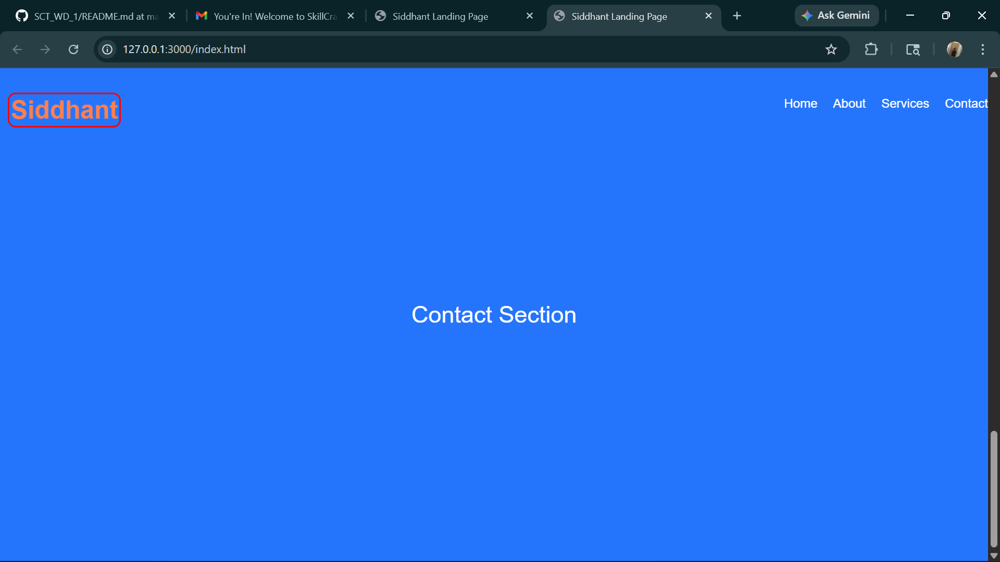

# SCT_WD_1
Responsive landing page with interactive fixed navbar (scroll &amp; hover effects) using HTML, CSS, and JavaScript.

This project is part of my Web Development Internship.
It is a responsive landing page that includes an interactive navigation bar which changes its style when the user scrolls the page or hovers over menu items.

The navigation menu is fixed and remains visible across all sections of the webpage, improving user experience and accessibility.

# Responsive Landing Page

This project is a responsive landing page created using HTML, CSS, and JavaScript. It demonstrates a simple and interactive navigation menu that changes style on scrolling.

## Features
- Responsive design
- Interactive navigation bar
- Smooth scrolling
- Simple and clean layout

## Technologies Used
- HTML
- CSS
- JavaScript

## How to Run
1. Clone the repository or download the files
2. Open index.html in any web browser

## Folder Structure
- index.html
- style.css
- script.js
- imges.png

## Project Screenshot

## Author
Siddhant Parit
